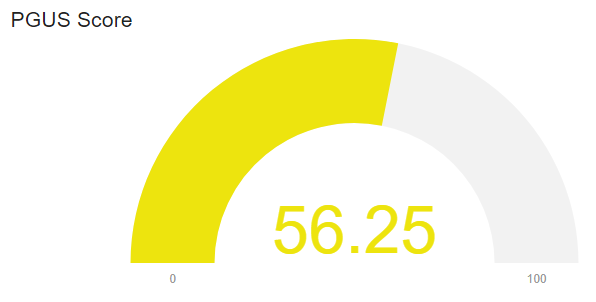
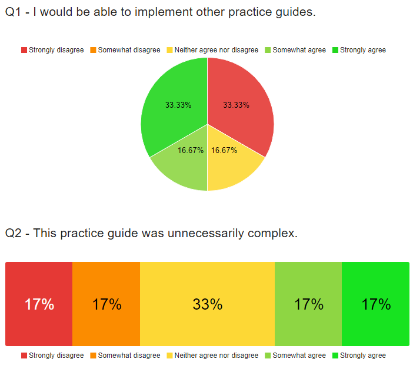
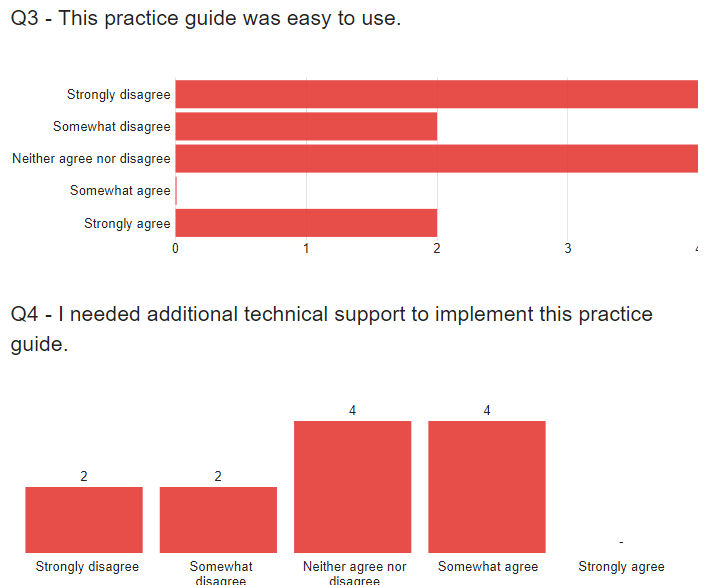
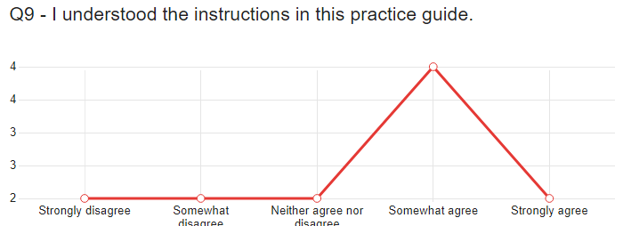
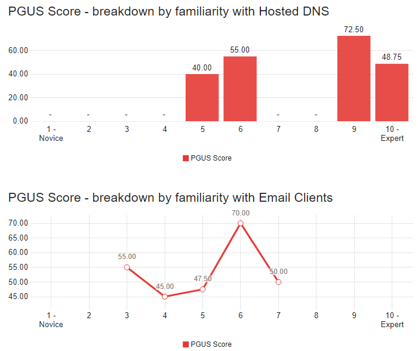
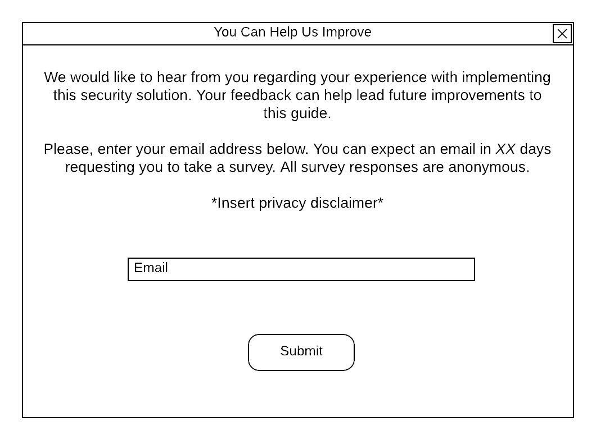
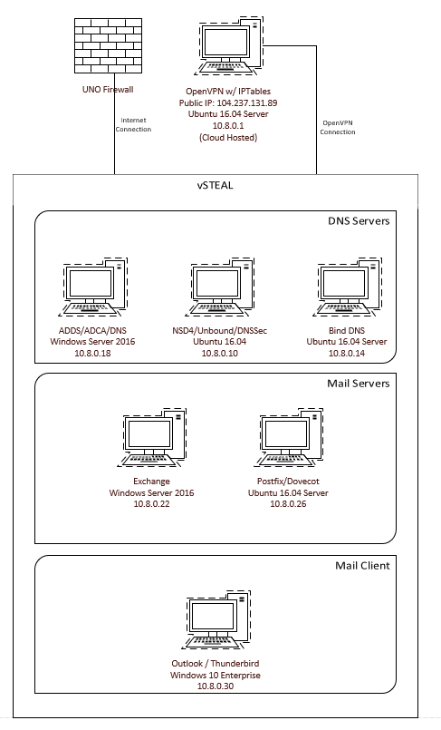
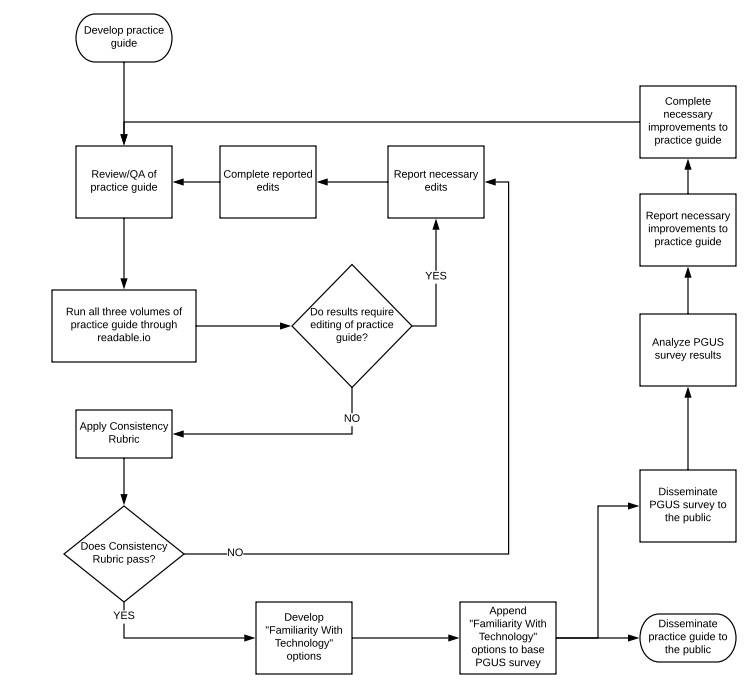

# NCCoE Practice Guide Vetting - Final Report
## Executive Summary
[comment]: # (We can copy and paste our original executive summary and update as needed.)
As rising security practitioners, we understand the need for quality guides explaining the how and why for best security practices. The NCCoE publishes the NIST SP 1800 series, which are a series of how-to guides that allow companies to implement various security policies in a step-by-step manner. These guides are designed for use by security professionals but may also be utilized by a general IT practitioner tasked with deploying the security implementation. Therefore, it is critical these guides are accurate and concise. For this project, the deliverable will be a grading scale that can be used to score the accuracy and conciseness of said documents. In particular, we’ll be implementing and focusing on DNS-Based Secure Email NIST SP 1800-6 Practice Guide. But, this grading scale can be used for any of the NIST SP 1800 series.

The ability to objectively compare readability, usability, consistency, and accuracy of the different NIST SP 1800 series documents is crucial, because user feedback can be difficult to quantify. Users often possess different technical backgrounds, expertise, and intelligence. This inevitably leads to different opinions on what constitutes a “good” guide. For example, these guides are used by both experienced security technicians and regular IT personnel. Obviously, a security technician would likely be more lenient on their usability scores, as they would likely have the background necessary to comprehend some of the technical jargon that is used in the guides.

Not only is the comparison of the documents important, but grading these documents with greater specificity will allow those tasked with improving the documents to focus their efforts on categories with lower scores. For example, if a certain NIST SP 1800 series document scores poorly in the category of readability, then it wouldn’t make much sense to have a highly technical person try and improve the document. Perhaps, efforts would be better served to have someone who specializes in technical communication work on the document so as not to waste resources.

Finally, poorly scored documents likely will not be used by companies wanting to implement that document’s specific security policy. So, efforts could be focused on improving that document in order to allow the implementation of that security policy to become more widespread. For instance, if the DNS-Based Secure Email NIST SP 1800-6 Practice Guide is scored poorly, then it would make sense to focus on the improvement of that document in order to allow companies to better implement the security policies proposed in the document.

## Project Goals
[comment]: # (We can copy and paste our original executive summary and update as needed.)
* Use the how-to guide to implement the security policy.
* Document any errors we find while using the how-to guide.
* Develop a grading scale for use on the entire NIST SP 1800 series based on our use of the DNS-Based Secure Email NIST SP 1800-6 Practice Guide.
* Explain and justify our grading scale criteria

## Project Methodology

## Readability Metric
[comment]: # (Methodology of applying readability metric)

Readability was considered by us to say just how easy it is to read the practice guide's summary portions. The NIST SP series feature three main parts, with parts A and B being more focused on giving overall information on the set up steps and how they will help rather than actual instructions to follow. Our readability score focuses on just the first two parts and doesn't analyze the C portion that has the actual how-to guide. The readability metric was found by running the document through a service called readable.io. readable.io is an online application that allows users to submit documents and receive back a readability grade, using scoring similar to schools with A+ being the best and F being at the bottom. This grade is found by running multiple tests and scale on the document submitted to give an overall grade. The readable.io service also allows for customization of what you want to check for, but for our own scale we left the configuration to the default. Products such as Grammarly were also looked at for our scale, but were later determined to not have reliable enough scoring.

When we ran the DNS-Based Secure Email NIST SP 1800-6 Pratice Guide through readable.io we recieved two scores:
* Part A: C
* Part B: B

These scores were done by inputting a PDF file, which we later found to give skewed results. For our actual scale, we recommend either using a plaintext file or an actual word processing file type such as .doc, as it will give the most accurate results from readable.io.

## Usability Metric
[comment]: # (Methodology of applying usability metric)
### Modify System Usability Scale From a Systems View to a Technical Document View

#### Overview of Systems Usability Scale

The System Usability Scale is a ten question 5-point likert scale survey. Each question is answered on a scale of 1 - 5 with one being "Strongly Disagree" and five being "Strongly Agree". The ten questions from the System Usability Scale (SUS) can be viewed as two "groups" of five questions each. All of the odd-numbered questions are a regular likert item. All of the even-numbered questions are a reverse-likert item. By being a reverse-likert item, the question is designed to be answered negatively. For example, the SUS has the question "I found the system unnecessarily complex." For the system to have high usability, the survey administrator would want the survey taker to answer "Strongly Disagree" to the item.

After all ten questions have been answered, the SUS score is calculated as follows:
<ul>
  <li> Each odd numbered question: questionScore = questionAnswer - 1 </li>
  <li> Each even numbered question: questionScore = 5 - questionAnswer </li>
  <li> Add up total of all questionScore </li>
  <li> Multiply total by 2.5 </li>
  <li> Result equals the SUS score </li>
</ul>

According to Thomas (2015), the SUS scores can be evaluated as follows:
<ul>
  <li> 80.3 and above = A. Users love the site and would recommend it to others </li>
  <li> 68 = C. There's room for improvement </li>
  <li> 51 and below = F. Usability needs to be made a priority and fixed quickly </li>
</ul>

#### Developing Practice Guide Usability Scale

The text of the original SUS questions have been modified to apply to the NIST Practice Guides while maintaining the integrity of the SUS questions. This new scale is the Practice Guide Usability Scale (PGUS).

| Question Number | System Usability Scale Question | Practice Guide Usability Scale Question |
| ---- | --------------------------------| --------------------------------------- |
| 1 | I think that I would like to use this system frequently. | I would be able to implement other practice guides. |
| 2 | I found the system unnecessarily complex. | This practice guide was unnecessarily complex. |
| 3 | I thought the system was easy to use. | This practice guide was easy to use. |
| 4 | I think that I would need the support of a technical person to be able to use this system. | I needed additional technical support to implement this practice guide. |
| 5 | I found the various functions in this system were well integrated. | The tasks in this practice guide were adequately explained. |
| 6 | I thought there was too much inconsistency in this system. | The instructions in this practice guide were inconsistent. |
| 7 | I would imagine that most people would learn to use this system very quickly. | Most people could easily implement this practice guide. |
| 8 | I found the system very cumbersome to use. | This practice guide was difficult to follow. |
| 9 | I felt very confident using the system. | I understood the instructions in this practice guide. |
| 10 | I needed to learn a lot of things before I could get going with this system. | Additional research was needed to complete implementation of this practice guide. |

##### Practice Guide Usability Scale Survey

The University of Nebraska at Omaha has a license for the survey building software Qualtrics. The PGUS survey was built and administered through Qualtrics. The survey consists of four pages. Page 1 contains the 10 usability questions. Pages 3-4 contain the technology familiarity questions (one page for each technology group). Qualtrics provides many methods for disseminating the survey including an anonymous link that can be shared, an email invite, or a QR code.

##### Familiarity With Technology

In order to take into account varying skill levels and technical backgrounds that may affect the PGUS score, the user of the practice guide will be asked various questions to gauge their familiarity with specific technologies utilized in the practice guide. The user is asked to rate their familiarity with specific technologies on a scale of 1 - 10 (1 being a Novice and 10 being an Expert). The technologies presented are specific technologies noted in the practice guide. This part of the survey can be modified and tailored to any of the other practice guides. The responses can be used to breakdown reports and gain fine grained insights into the PGUS score. The insights gained can guide future improvements and/or revisions to the practice guide. 
* For example: A large number of users self identify as being an expert with Microsfot Outlook, but the average PGUS score of this user group is low. It is possible Miscrosoft Outlook has some unique qwirks that make implementing the guide difficult. Improvements/revisions to the practice guide could provide more details for implementation with Microsoft Outlook (possibly even an appendix specific to an implementation with Microsoft Outlook).

For this practice guide, the specific technologies noted include DNS, e-mail servers, and e-mail clients. The three technology groups are broken into specific technologies.

DNS is broken into:
* Hosted DNS
* Windows DNS
* BIND DNS
* Unbound DNS
* OpenDNSSec

E-mail servers is broken into:
* Hosted E-mail Servers
* Microsoft Exchange
* Postfix/Dovecot

E-mail Clients is broken into:
* Email Clients
* Microsoft Outlook
* Thunderbird

With each group of technologies, there is a Yes/No question asking the user if they are familiar with any other products of the technology group not listed. If the user selects "Yes", a comment box appears allowing the user to enter other products.

##### Section Review

In addition to the above two portions of the survey, a third addition was added to provide greater metrics on a per section basis. Essentially, feedback from individual sections would be helpful and insightful in a similar way above: If a user lists themselves as an expert with BIND, but found that section difficult to use, then it needs to be adjusted. The value here is seeing which sections may be providing the users the most difficulty in the overall scoring provided above.

As with the Familiarity with technology survey, it is necessary to recreate this for each survey. The first question prompted to the user, looks like this:

Which of the following sections from the guide did you read or attempt to carry out the tasks within:
 * Section 2.1 Labratory Setup
 * Section 2.2 How to install and Configure Microsoft Server-Based DNS-Protected Email Security Componets
 
 ...
 * Appendix G: Microsoft Installation for the NCCoE
 * Appendix H: Installation and Configuration of DNS Authority, DNS Cache, and DNS Signer at the NCCoE
 
The above question lists each section of the guide, and the user selects each applicable section. Then, the user receives a dynamically created survey with questions for each survey, using the following template:

The information within this section was accurate
* Strongly Agree
* Somewhat Agree
* Neither Agree nor Disagree
* Somewhat Disagree
* Strongly disagree

I needed to perform further research to understand the content of this section
* Strongly Agree
* Somewhat Agree
* Neither Agree nor Disagree
* Somewhat Disagree
* Strongly disagree

The skills and knowledge learned from this section are relevant to my job
* Strongly Agree
* Somewhat Agree
* Neither Agree nor Disagree
* Somewhat Disagree
* Strongly disagree

I would recommend this section to help others
* Strongly Agree
* Somewhat Agree
* Neither Agree nor Disagree
* Somewhat Disagree
* Strongly disagree

Which subsections or steps, if any, did you find difficult, inaccurate, or incomplete?
* *User input textbox would go here*

##### Check Out The Survey!

Below is the link to a live PGUS survey and familiarity with technology combined and the section review for the purpose of collecting test data. Feel free to go through the surveys on your own. Ideally when distrubuted these would be combined into 1 survey.

[Click here to take the survey](https://unomaha.az1.qualtrics.com/jfe/form/SV_9RbKmkT30EXgRh3)

[Click here for the Section Review](https://unomaha.az1.qualtrics.com/jfe/form/SV_2nRYEaViIN9SjeR)

#### Calculating PGUS Score

Qualtrics provides the ability to develop custom metrics. The same methodology for calculating the System Usability Scale was followed:
<ul>
  <li> Each odd numbered question: questionScore = questionAnswer - 1 </li>
  <li> Each even numbered question: questionScore = 5 - questionAnswer </li>
  <li> Add up total of all questionScore </li>
  <li> Multiply total by 2.5 </li>
  <li> Result equals the PGUS score </li>
</ul>

A custom metric using the below formula to calculate the PGUS score was developed. This score is calculated on the backend after the user completes the survey.

x1,x2,...,x10 refers to Question 1, Question 2, ..., Question 10

PGUS Score = ((x1 - 1)+(5-x2)+(x3-1)+(5-x4)+(x5-1)+(5-x6)+(x7-1)+(5-x8)+(x9-1)+(5-x10))*2.5

#### Reporting PGUS Results

##### PGUS Score

The PGUS custom metric was used to develop a custom report. This report disaplys the average PGUS score of all survey takers as a gauge. The gauge is color coded based on the SUS score evaluation outlined by Thomas (2015):
<ul>
  <li> 80.3 and above = A. Users love the site and would recommend it to others </li>
    <ul>
      <li> Gauge will be red</li>
    </ul>
  <li> 68 = C. There's room for improvement </li>
    <ul>
      <li> Gauge will be yellow</li>
    </ul>
  <li> 51 and below = F. Usability needs to be made a priority and fixed quickly </li>
    <ul>
      <li> Gauge will be green</li>
  </ul>
</ul>

##### Usability Question Results - Different Visualizations Available In Qualtrics

##### PGUS Breakdown By Technology Familiarity

#### Survey Dissemination Methodology

To disseminate the PGUS survey to users, we recommend having users voluntarily register with an email address to receive the survey. When a user visits the NCCoE website and clicks on the download link for a practice guide, a registration window will pop-up after the guide has completed downloading.
(Example registration pop-up)

The email input field will validate user input to ensure a valid email address is entered. Upon clicking the "Submit" button, the registration will be timestamped. On the backend, a survey invitation email will be scheduled for the user. Based on what guide the user downloaded, they will be scheduled to receive that PGUS survey. Upon successful registration, an email will be sent to the user _XX_ days later. To start, an email should be sent to the user 30 days after successful registration.

The email will contain a Yes/No question asking the user if they have completed implenting the security solution. If the user answers "Yes", they will be provided with an anonymous survey link and asked to complete the survey. If the user answers "No", they will be informed that they'll be receiving a follow-up in _XX_ number of days. To start, 30 days should be the amount of time until an invite email is sent.

The number of "No" responses received can be used to adjust how many days after successful registration until the user receives the first email. If the number of "No" responses is _YY_% (organization agreed upon percentage), then increase the number of days before the first email is sent. This same logic can be applied to the number of days before a reminder email is sent.

Survey completion rate can be calculated as follows:

</a>

## Consistency Metric
Once the first draft of the guide has been completed, apply the consistency rubric shown below to the guide. If it scores poorly (say, below a 16), then evaluate and edit the guide appropriately.
### Rubric - Score/20

|Category |4 |3 |2 |1 |
|---------|--|--|--|--|
|Problem  |All 3 sections are in near-perfect agreement on what the problem is to be solved. Each section provides the appropriate audience a clear picture of what they would find in the other sections. |All 3 sections are mostly in agreement on what the problem is to be solved. There may be some ambiguity in a certain section. |All 3 sections are somewhat in agreement on what the problem is to be solved. There is ambiguity present in 2 sections. |All 3 sections are not-at-all in agreement on what the problem is to be solved. The problem is extremely unclear throughout all 3 sections. |
|Solution |All 3 sections are in near-perfect agreement on what the solution is to the problem. Each section provides the appropriate audience a clear picture of what they would find in the other sections. |All 3 sections are mostly in agreement on what the solution is to the problem. There may be some ambiguity or contradictions in a certain section. |All 3 sections are somewhat in agreement on what the solution is to the problem. There is ambiguity or contradictions present in 2 sections. |All 3 sections are not-at-all in agreement on what the solution is to the problem. The solution is extremely unclear and/or contradictory throughout all 3 sections. |
|Approach |Section C specifically implemented the proposed solution from sections A and B with no deviation. |Section C generally implemented the proposed solution from sections A and B with occasional deviation. |Section C somewhat implemented the proposed solution from sections A and B with some important deviations. |Section C’s approach to solving the problem is not-at-all what is proposed in sections A and B. There are numerous deviations between sections. |
|Benefits |Section C’s implementation of the solution provided all of the benefits proposed in section A. |Section C’s implementation provided most of the benefits proposed in section A. |Section C’s implementation provided some of the benefits proposed in section A. |Section C’s implementation provided few-to-none of the benefits proposed in section A. |
|Acknowledgements |Credit was given to all appropriate parties within each section. For example, if an acknowledgement was made in section A, that same acknowledgement was recognized in sections B and C if it was appropriate to do so. |Credit was given to most of the appropriate parties within each section. |Credit was given to some of the appropriate parties within each section. |Credit was given to almost none of the appropriate parties within each section. |

## Replicating Practice Guide
[comment]: # (Methodology of replicating practice guide example)
Due to the size, breadth, and nature of the guide, it was decided to complete the guide as groups of two. Each group attempted to complete the guide as if they were an organization trying to implement the guide using technologies at their current organization. So, one group attempted a more Microsoft implementation as if they were a pre-existing Windows shop, and the other group tried to recreate the guide using the Linux portions.

For the environment, the guide was completed within VMware vCenter and the cloud-hosting provider, Linode. The use of Linode was necessary to create a VPN between the environment located in vCenter, acting as a gateway for the network. This allowed a single public IP for use for external services. For each group to switch services to point to their implementation, two IPTables files were created and swapped between. Here is what the environment looked like:

Using the accuracy metric defined above, both groups gave an accuracy score of 100%. Steps provided were able to be followed without error, with basic changes like substituting Windows Server 2016 Technical Preview with the actual version of Windows Server 2016.

However, the guide itself did have some issues. Some areas felt vague and incomplete. Perhaps the largest example of this was section 2.3: 'How to Install and Configure BIND'. This section had 3 pages on how to compile BIND for essentially any platform, but did not go over configuration besides to links to the documentation. While the documentation is good, it would have been nice to see example zone files and such like the ones provided for NSD4 sections.

Another large issue with the guide was the overall implementation for Secure64 products in the guide. Anytime any configuration was needed, it was recommended to simply go to https://www.secure64.com, with no further instruction on where to go beyond that point to complete the implementation. It looks like the documentation is behind a paywall, but perhaps at least a title for the necessary document would help.

Finally, no instruction was given for registrar setup. While not difficult, it would be useful for some minor details to be included, because that is part of the implementation. For example, GoDaddy, only allows certain tld's to work with DNSSec. Even just mentioning this would be beneficial, in addition to basic instruction on how to redirect DNS configuration to a user-owned server. Even if the information was included for the top 3 registrars, it would make the guide easier for the users.

## Results / Findings
[comment]: # (brief overview of outcomes - bulleted list of milestone 1/2/3 outcomes and any addl' outcomes)
* Obtained readable.io subscription
* Obtained readability score from readable.io
* Obtained Grammarly error report
* Developed questions for Practice Guide Usability Scale (PGUS) survey
* Developed "Familiarity With Technology" questions
  * Questions added to PGUS survey
* Created mock survey data for PGUS survey
* Configured reporting site for PGUS survey results
* Proposed methodology for disseminating PGUS survey to the public 
* Developed Consistency Rubric
* Completed set up of base lab environment
  * Obtained a domina name (capstone.uomaha.com)
  * Obtained public IP via cloud hosting
 * Replicated practice guide
  * Calculated accuracy score
  * Recorded areas of guide that felt vague and/or incomplete

## How to Use the Grading Scale
[comment]: # (This section replaces the "Install Instructions" section of the suggested format from Dr. Hale.)
In order to use the grading survey we’ve created, there are a number of steps that will need to be taken. The ten likert questions from the survey are homogenous across all practice guides. Familiarity with technology questions will need to be created specifically for the practice guide in question. The following steps need to be taken in order:

### Creating the PGUS
1. Follow the instructions to create technical questions found in the TechnicalSurvey folder. This is probably best done by those who have created the practice guide.
2. Prepend these questions to the PGUS questions.
3. Ensure the PGUS (with the technical questions) can be easily referenced alongside the practice guide.
4. Documents for the PGUS survey can be found <a href="./QualtricsDoc">here</a>.
    1. The .qsf document can be imported into a new Qualtrics account.
    2. <a href="https://www.qualtrics.com/support/survey-platform/survey-module/survey-tools/import-and-export-surveys/">Click here for instructions on importing a .qsf file into Qualtrics.</a> 

### After Using the Guide
1. Have users answer the PGUS questions.
2. Calculate the PGUS results as specified in the UsabilityScoring folder.
3. Once enough people have taken the PGUS, there should be enough data to draw conclusions about how the practice guide should be changed.
4. Change the practice guide appropriately.
5. Have more users use and answer the PGUS questions.

### Process For Applying All Metrics
Rather than developing a comprehensive grading scale, we feel the metrics analyzed are better suited for enhancing the full development lifecycle of a practice guide. Applying the readability and consistency metrics is most beneficial during the development process. These metrics will help ensure a higher quality guide is presented to the public. The usability metric is most beneficial during the revision/practice guide enhancement phase. Results of the PGUS survey can help guide future revisions and provide focus for areas of the practice guide that can be enhanced.

