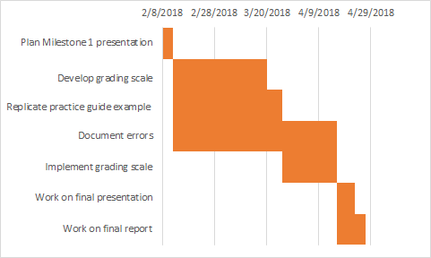

NCCoE Practice Guide Vetting - Project Proposal
===============================================

Executive Project Summary
-------------------------

### Problem Statement
As rising security practitioners, we understand the need for quality guides explaining the how and why for best security practices. The NCCoE publishes the NIST SP 1800 series, which are a series of how-to guides that allow companies to implement various security policies in a step-by-step manner. These guides are designed for use by security professionals but may also be utilized by a general IT practitioner tasked with deploying the security implementation. Therefore, it is critical these guides are accurate and concise. For this project, the deliverable will be a grading scale that can be used to score the accuracy and conciseness of said documents. In particular, we’ll be implementing and focusing on DNS-Based Secure Email NIST SP 1800-6 Practice Guide. But, this grading scale can be used for any of the NIST SP 1800 series.

### Project Goals
<ul>
  <li>Use the how-to guide to implement the security policy.
  <li>Document any errors we find while using the how-to guide.
  <li>Develop a grading scale for use on the entire NIST SP 1800 series based on our use of the DNS-Based Secure Email NIST SP 1800-6 Practice Guide.
  <li>Explain and justify our grading scale criteria
</ul>

### Project Merit
The ability to objectively compare readability, usability, consistency, and accuracy of the different NIST SP 1800 series documents is crucial, because user feedback can be difficult to quantify. Users often possess different technical backgrounds, expertise, and intelligence. This inevitably leads to different opinions on what constitutes a “good” guide. For example, these guides are used by both experienced security technicians and regular IT personnel. Obviously, a security technician would likely be more lenient on their usability scores, as they would likely have the background necessary to comprehend some of the technical jargon that is used in the guides.
Not only is the comparison of the documents important, but grading these documents with greater specificity will allow those tasked with improving the documents to focus their efforts on categories with lower scores. For example, if a certain NIST SP 1800 series document scores poorly in the category of readability, then it wouldn’t make much sense to have a highly technical person try and improve the document. Perhaps, efforts would be better served to have someone who specializes in technical communication work on the document so as not to waste resources.

Finally, poorly scored documents likely will not be used by companies wanting to implement that document’s specific security policy. So, efforts could be focused on improving that document in order to allow the implementation of that security policy to become more widespread. For instance, if the DNS-Based Secure Email NIST SP 1800-6 Practice Guide is scored poorly, then it would make sense to focus on the improvement of that document in order to allow companies to better implement the security policies proposed in the document.

Project Timeline
----------------

  

Risk List
---------

|Risk Name (Value)      |Impact |Likelihood |Description |
|-----------------------|-------|-----------|------------|
|Limited Breadth of Testing (28)| 4 | 7 | For our grading scale we would want to make sure that we get a lot of outside opinion on whether our grading scale is accurate. We will likely not gather a large amount of outside testing. So, most of the opinion on the scale will be done by us. |
|Lack of Time (24)| 6 | 4 | There is a possiblity that we have not given ourselves enough time to complete a grading scale for the NIST guides. If we are low on time, our product will end up being either incomplete or of a worse quality. |
|Limited Understanding (20)| 5 | 4 | The guides that we will be creating a grading scale for will have a lot of technical details that we may not have knowledge of. It could be hard for us to make an accurate scale for the how-to guides if we don't understand the topics behind them. While we may be able to complete all of them, we might not know what we actually did. |
|Failed Replication of Chosen Guide (14)| 7 | 2 | It is very unlikely that this will occur, but if we are unable to actually complete the practice guide chosen to test our grading scale, then we will never know how well our scale will perform. While a how-to guide that we can't complete should scale badly on our scale, we will not be able to tell how well our grading scale will perform on a working how-to guide. |
|Loss of Group Member (10) | 10 | 1 | A group member may have a personal issue appear or have some reason to drop the class or not participate anymore. If this occurs we will be heavily impacted, but the chance of this is low. |

Project Methodology
-------------------

*literary placeholder*

*technical plan placeholder*

Resources Needed
----------------

Due to wide coverage of the document, the number of resources used is quite extensive. As such, in order to maximize the list readability it is necessary to split up the tables by portion of the project.

### General
| Resources | Non team member help needed? | Investigating Team member | Description |
|-------------------|---------|---------------------------|-------------|
| GitHub | No | - | Used to facilitate collaborative efforts |
| Google Drive | No | - | Used to facilitate collaborative efforts |
| Slack | Yes | - | Official form of contact between group members |

### Required to Perform Document Analysis
| Resources | Non team member help needed? | Investigating Team member | Description |
|-------------------|---------|---------------------------|-------------|
| ISO 9241-11 | Yes | Dan | ISO standard that defines usability and readability |
| readable.io | Yes | Dan | Used to perform text grading analysis |
| BETSY | Yes | Dan | Windows-based program that classifies text based on trained material |

### Required to Recreate the Lab
| Resources | Non team member help needed? | Investigating Team member | Description |
|-------------------|---------|---------------------------|-------------|
| Rackspace / VM Hosting | Yes | Cody | Lots of options - vSTEAL, Team member provided infrastructure/sandbox, Cloud Hosted (Azure, AWS), or running locally to host the virtual labs. Most likely Hyper-V or VMWare |
| Public IPs | Depends on above | Scott | Public IP is needed for hosting |
| Domain Name(s) | Yes | Scott | Need a domain to purchase with the ability to override the nameservers to ours |
| Secure64 DNS Signer, DNS Cache, DNS Authority, and DNS Manager | Yes | Cody | This was used as the other end of their lab, provided by and configured by Secure64 |
| Windows Server 2016 | No | Cody | Required for the ADDS, ADCS, and Windows-based DNS portion of the lab |
| Microsoft Exchange 2016 | No | Cody | Required for the Windows-based Mail Transfer Agent |
| Postfix with Dovecot | No | Liam | Required for Linux-based Mail Transfer Agent |
| NSD4 Authoritative Name Server | No | Liam | Open-source DNS Server |
| OpenDNSSEC Domain Name Security Manager | No | - | Used to secure DNS zone data before it is published to an authoritative name server |
| Unbound DNS Resolver | No | - | DNS Resolver with DNSSEC Validation |
| BIND Resolver & Domain Name Authority Server | No | Cody | DNS Resolver with DNSSEC Validation and DNSSEC in-line signing |
| Outlook, Thunderbird | No | Liam | Mail clients necessary to perform the lab |

Sources
-------

*placeholder for sources*
