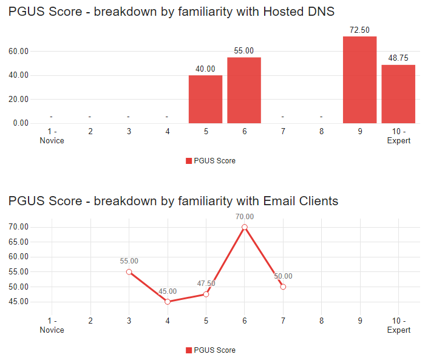

# Modify System Usability Scale From a Systems View to a Technical Document View

## Overview of Systems Usability Scale

The System Usability Scale is a ten question 5-point likert scale survey. Each question is answered on a scale of 1 - 5 with one being "Strongly Disagree" and five being "Strongly Agree". The ten questions from the System Usability Scale (SUS) can be viewed as two "groups" of five questions each. All of the odd-numbered questions are a regular likert item. All of the even-numbered questions are a reverse-likert item. By being a reverse-likert item, the question is designed to be answered negatively. For example, the SUS has the question "I found the system unnecessarily complex." For the system to have high usability, the survey administrator would want the survey taker to answer "Strongly Disagree" to the item.

After all ten questions have been answered, the SUS score is calculated as follows:
<ul>
  <li> Each odd numbered question: questionScore = questionAnswer - 1 </li>
  <li> Each even numbered question: questionScore = 5 - questionAnswer </li>
  <li> Add up total of all questionScore </li>
  <li> Multiply total by 2.5 </li>
  <li> Result equals the SUS score </li>
</ul>

According to Thomas (2015), the SUS scores can be evaluated as follows:
<ul>
  <li> 80.3 and above = A. Users love the site and would recommend it to others </li>
  <li> 68 = C. There's room for improvement </li>
  <li> 51 and below = F. Usability needs to be made a priority and fixed quickly </li>
</ul>

## Developing Practice Guide Usability Scale

The text of the original SUS questions have been modified to apply to the NIST Practice Guides while maintaining the integrity of the SUS questions. This new scale is the Practice Guide Usability Scale (PGUS).

| Question Number | System Usability Scale Question | Practice Guide Usability Scale Question |
| ---- | --------------------------------| --------------------------------------- |
| 1 | I think that I would like to use this system frequently. | I would be able to implement other practice guides. |
| 2 | I found the system unnecessarily complex. | This practice guide was unnecessarily complex. |
| 3 | I thought the system was easy to use. | This practice guide was easy to use. |
| 4 | I think that I would need the support of a technical person to be able to use this system. | I needed additional technical support to implement this practice guide. |
| 5 | I found the various functions in this system were well integrated. | The tasks in this practice guide were adequately explained. |
| 6 | I thought there was too much inconsistency in this system. | The instructions in this practice guide were inconsistent. |
| 7 | I would imagine that most people would learn to use this system very quickly. | Most people could easily implement this practice guide. |
| 8 | I found the system very cumbersome to use. | This practice guide was difficult to follow. |
| 9 | I felt very confident using the system. | I understood the instructions in this practice guide. |
| 10 | I needed to learn a lot of things before I could get going with this system. | Additional research was needed to complete implementation of this practice guide. |

### Practice Guide Usability Scale Survey

The University of Nebraska at Omaha has a license for the survey building software Qualtrics. The PGUS survey was built and administered through Qualtrics. The survey consists of four pages. Page 1 contains the 10 usability questions. Pages 3-4 contain the technology familiarity questions (one page for each technology group). Qualtrics provides many methods for disseminating the survey including an anonymous link that can be shared, an email invite, or a QR code.

### Familiarity With Technology

In order to take into account varying skill levels and technical backgrounds that may affect the PGUS score, the user of the practice guide will be asked various questions to gauge their familiarity with specific technologies utilized in the practice guide. The user is asked to rate their familiarity with specific technologies on a scale of 1 - 10 (1 being a Novice and 10 being an Expert). The technologies presented are specific technologies noted in the practice guide. This part of the survey can be modified and tailored to any of the other practice guides. The responses can be used to breakdown reports and gain fine grained insights into the PGUS score. The insights gained can guide future improvements and/or revisions to the practice guide. 
* For example: A large number of users self identify as being an expert with Microsfot Outlook, but the average PGUS score of this user group is low. It is possible Miscrosoft Outlook has some unique qwirks that make implementing the guide difficult. Improvements/revisions to the practice guide could provide more details for implementation with Microsoft Outlook (possibly even an appendix specific to an implementation with Microsoft Outlook).

For this practice guide, the specific technologies noted include DNS, e-mail servers, and e-mail clients. The three technology groups are broken into specific technologies.

DNS is broken into:
* Hosted DNS
* Widnows DNS
* BIND DNS
* Unbound DNS
* OpenDNSSec

E-mail servers is broken into:
* Hosted E-mail Servers
* Microsoft Exchange
* Postfix/Dovecot

E-mail Clients is broken into:
* Email Clients
* Microsoft Outlook
* Thunderbird

With each group of technologies, there is a Yes/No question asking the user if they are familiar with any other products of the technology group not listed. If the user selects "Yes", a comment box appears allowing the user to enter other products.

### Check Out The Survey!

Below is the link to a live PGUS survey for the purpose of collecting test data. Feel free to go through the survey on your own.

<a href="https://unomaha.az1.qualtrics.com/jfe/form/SV_9RbKmkT30EXgRh3">Click here to take the survey.</a>

## Caculating PGUS Score

Qualtrics provides the ability to develop custom metrics. The same methodology for calculating the System Usability Scale was followed:
<ul>
  <li> Each odd numbered question: questionScore = questionAnswer - 1 </li>
  <li> Each even numbered question: questionScore = 5 - questionAnswer </li>
  <li> Add up total of all questionScore </li>
  <li> Multiply total by 2.5 </li>
  <li> Result equals the PGUS score </li>
</ul>

A custom metric using the below formula to calculate the PGUS score was developed. This score is calculated on the backend after the user completes the survey.

x1,x2,...,x10 refers to Question 1, Question 2, ..., Question 10

PGUS Score = ((x1 - 1)+(5-x2)+(x3-1)+(5-x4)+(x5-1)+(5-x6)+(x7-1)+(5-x8)+(x9-1)+(5-x10))*2.5

## Reporting PGUS Results

### PGUS Score

The PGUS custom metric was used to develop a custom report. This report disaplys the average PGUS score of all survey takers as a gauge. The gauge is color coded based on the SUS score evaluation outlined by Thomas (2015):
<ul>
  <li> 80.3 and above = A. Users love the site and would recommend it to others </li>
    <ul>
      <li> Gauge will be red</li>
    </ul>
  <li> 68 = C. There's room for improvement </li>
    <ul>
      <li> Gauge will be yellow</li>
    </ul>
  <li> 51 and below = F. Usability needs to be made a priority and fixed quickly </li>
    <ul>
      <li> Gauge will be green</li>
  </ul>
</ul>

### Usability Question Results - Different Visualizations Available In Qualtrics

### PGUS Breakdown By Technology Familiarity

## Survey Dissemination Methodology

To disseminate the PGUS survey to users, we recommend having users voluntarily register with an email address to receive the survey. When a user visits the NCCoE website and clicks on the download link for a practice guide, a registration window window will pop-up.

The email input field will validate user input to ensure a valid email address is entered. Upon clicking the "Submit" button, the registration will be timestamped. On the backend, a survey invitation email will be scheduled for the user. Based on what guide the user downloaded, they will be scheduled to receive that PGUS survey.

