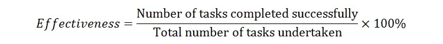

The NCCoE produces practice guides (NIST SP 1800 series) in an effort to increase adoption of NIST standards and cybersecurity technologies. Each guide consists of three volumes. Volume A is a high level executive summary. Volume B contains rationale for adopting the method described and functional evaluations. Volume C contains detailed how-to instructions on how to implement the method. Although the guides describe specific technologies, they are designed to be used with other products. There is little to no research into the usability of technical how-to guides. We will look at look at existing usability scales in user experience design and investigate their usage with the practice guides.

ISO 9241-11 (1998) defines usability as the "Extent to which a product can be used by specified users to achieve specified goals with effectiveness, efficiency and satisfaction in a specified context of use." Effectiveness is defined as "Accuracy and completeness with which users achieve specified goals." According to an article by Justin Mifsud (2015) discussing ISO 9241-11, effectiveness can be calculated by measuring completion rate. Mifsud provided the follolwing formula to calculate effectiveness as a percentage:

This measurement can be applied to Volume C of the practice guides. Due to the technical nature of the document, an ideal effectiveness rating would be 100%. We can hypothesize that if one task is not completed successfully, the implementation of that guide's method can not be adequately completed. For that reason, we can instead calculate effectiveness by measuring number of errors. Mifsud defines erorrs as "unintended actions, slips, mistakes or omissions that a user makes while attempting a task."

ISO 9241-11 (1998) defines satisfaction as "Freedom from discomfort, and positive attitudes towards the use of the product." Mifsud (2015) states "User satisfaction is measured through standardized satisfaction questionnaires which can be administered after each task and/or after the usability test session." The article lists several types of questionnaires and the usage of each. The System Usability Scale (SUS) is a proven method for evaluating the usability of systems compared to industry standards (Thomas, 2015). SUS is a 10 question survey utliizing a 5 point likert scale and is administered to a user at the end of the test session. According to Thomas (2015), the average SUS score is 68. With adequate time and resources for a usability test session, satisfaction could be measured for the practice guides through administration of an SUS-type survey. Usability test session participants should include a mix of technology experts (for technology realted to the practice guide), varying levels of cybersecurity professionals, and varying levels of IT professionals. 

Other metrics of interest to apply to the guides are accuracy, readability, understandability, and consistency. Consistency applies to consistent messaging acorss all three volumes of the guide. Areas of inconsistency between volumes will be recorded and reported. Accuracy applies to Volume C. It is important the instructions are correct. To measure the accuracy of the guide as a percentage, the following formula can be used:

While replicating the practice guide example, any tasks containing errors will be recorded. The accuracy of the how-to guide will then be calculated and reported.

According to an article posted by the Technical Communication Center (techwriter, 2010), readability "measures how easy to read and understand a document is, assuming the readers are identical in understanding of the subject matter." This artcile suggests three readability formulas to measure a technical documentation.

1. Flesch Reading Ease Index calculates reading ease on a scale of 0 - 100 with 0 being very difficult to read and 100 being very easy to read.

2. Flesch-Kinkaid Readability Index calculates the expected grade level of a reader needed to comfortably understand the text.

3. Gunning-Fog Readability Index calculates the number of years of formal education needed by the reader to underdstand the text.

Many automated tools are available to calculate readability and understandability. Readable.io is a software that calculates multiple readability formulas. To further measure understandability during the replication phase, we will document any areas of the how-to guide that require additional research/knowledge outside of the practice guide. These metrics primarily apply to volumes A and B.

Interrater reliability measures agreement among data collectors. According to McHugh (2012), interrater reliability is a concern "...due to the fact that multiple people collecting data may experience and interpret the phenomena of interest differently." Reliability of data collection increases overall confidence in the accuracy of a research study (McHugh, 2012). Cohen's kappa, developed by Jacob Cohen in the 1960s, is one measurement of interrater reliability. This measure accounts for random agreement among data collectors. Cohen's kappa calculates a score of 0 to 1 with 0 meaning no agreement and 1 meaning perfect agreement.

## Sources

ISO/IEC, (1998). ISO/IEC 9241-11:1998 Ergonomic requirements for office work with visual display terminals (VDTs) -- Part 11: Guidance on usability. Geneva, Switzerland: ISO/IEC. Retrieved from https://www.iso.org/obp/ui/#iso:std:iso:9241:-11:ed-1:v1:en

McHugh, Mary L. (October 15, 2012). Interrater reliability: the kappa statistic. *Biochemia Medica*. Retrieved from https://www.ncbi.nlm.nih.gov/pmc/articles/PMC3900052/

Misfud, Justin. (June 22, 2015). Usability Metrics – A Guide To Quantify The Usability Of Any System. *Usability Geek*. Retrieved from
https://usabilitygeek.com/usability-metrics-a-guide-to-quantify-system-usability/

techwriter. (October 7, 2010). 3 Different Readability Indexes for your Technical Document. *Technical Communication Center*. Retrieved from https://www.technicalcommunicationcenter.com/2010/10/07/3-different-readability-indexes-for-your-technical-document/

Thomas, Nathan. (July 13, 2015). How To Use The System Usability Scale (SUS) To Evaluate The Usability Of Your Website. *Usability Geek*. Retrieved from https://usabilitygeek.com/how-to-use-the-system-usability-scale-sus-to-evaluate-the-usability-of-your-website/

https://readable.io/

https://support.office.com/en-us/article/Test-your-document-s-readability-85b4969e-e80a-4777-8dd3-f7fc3c8b3fd2

http://echo.edres.org:8080/betsy/
